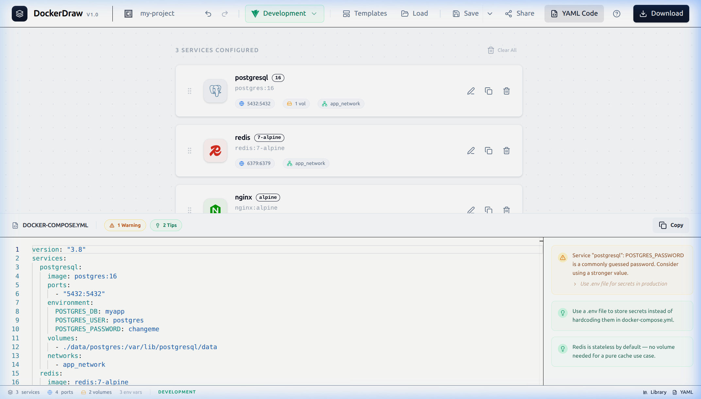

<div align="center">
  
  <h1>DockerDraw</h1>
  <p><strong>Visually design, configure, and export Docker Compose stacks — no terminal required.</strong></p>

  [](https://opensource.org/licenses/MIT)
  [](https://react.dev)
  [](https://www.typescriptlang.org/)
  [](https://vitejs.dev/)

  <br />
  
</div>

<hr />

## 📖 About DockerDraw

DockerDraw is a powerful, browser-based visual editor designed to simplify the creation and management of `docker-compose.yml` files. Whether you are scaffolding a complex microservices architecture or just setting up a simple LAMP stack, DockerDraw eliminates syntax errors and reduces configuration time by providing an intuitive, drag-and-drop interface.

## ✨ Key Features

### 🎨 Visual & Intuitive
* **Visual Service Editor**: Drag and drop service cards to build your stack visually.
* **Service Library**: Access over 15 pre-configured service templates (PostgreSQL, Redis, Nginx, RabbitMQ, etc.).
* **Template Gallery**: Jumpstart your project using battle-tested blueprints (e.g., MERN, WordPress).
* **Responsive Design**: Premium mobile experience with touch-optimized controls and full-screen previews.

### ⚙️ Powerful Configuration
* **Live YAML Sync**: Watch your `docker-compose.yml` update in real time with a built-in Monaco Code Editor.
* **Import & Export**: Easily import an existing `docker-compose.yml` to visualize its structure, or export your finalized stack with one click.
* **Intelligent Validation**: 
  * Port conflict detection alerts you when services share identical host ports.
  * Circular dependency detection prevents invalid `depends_on` relationships.
* **Environment Presets**: Swiftly toggle between Development and Production configurations to automatically tune restart policies and boundaries.

### ⌨️ Developer Experience
* **Undo / Redo Engine**: Complete history tracking allowing you to safely revert mistakes (`Ctrl+Z` / `Ctrl+Shift+Z`).
* **Command Palette**: Power-user friendly command palette accessible via `Ctrl+K`.

### 🤖 AI-Powered Assistant
* **Intelligent Scaffolding**: Describe your stack in natural language and let the AI generate it for you.
* **Smart Debugging**: Use the built-in AI chat to troubleshoot configurations or ask for best practices.
* **Privacy-First Proxy**: Secure backend integration ensures your API keys are never exposed to the frontend.

## 🛠️ Technology Stack

Built with modern web technologies focusing on performance and type-safety:

| Layer | Technology |
|-------|-----------|
| **Core** | React 19, TypeScript |
| **Build System** | Vite 7 |
| **AI Engine** | Groq (Llama 3.3 70B), Vercel AI SDK |
| **Styling** | Tailwind CSS 4, Radix UI |
| **Backend** | Vercel Serverless Functions (API Proxy) |
| **State Management** | Zustand (with Zundo for history) |
| **Editors** | Monaco Editor, js-yaml |

## 🚀 Getting Started

### Prerequisites
* Node.js 18+ or later
* npm, yarn, or pnpm

### Local Development

1.  **Clone & Install**:
    ```bash
    git clone https://github.com/a-omarr/DockerDraw
    cd DockerDraw
    npm install
    ```

2.  **Environment Setup**:
    Create a `.env` file in the root directory:
    ```env
    GROQ_API_KEY=your_groq_api_key_here
    ```
    *(Get your free key at [console.groq.com](https://console.groq.com))*

3.  **Start Development**:
    ```bash
    npm run dev
    ```

Open `http://localhost:5173` in your browser.

### Production Build

To test the optimized production build locally:
```bash
npm run build
npm run preview
```

## 📂 Project Architecture

```
src/
├── components/      # Specialized UI components
│   ├── ui/          # Standardized, reusable primitives (Radix UI wrappers)
│   ├── canvas/      # Core visual drag-and-drop editor
│   ├── modals/      # Application dialogs and overlays
│   └── panels/      # Configuration and property sidebars
├── data/            # Preset service blueprints and gallery templates
├── hooks/           # Custom React hooks (e.g., shortcut management)
├── store/           # Global Zustand state and middleware
├── types/           # TypeScript interfaces and domain models
└── utils/           # Transformation logic (YAML <-> State), validations
```

## 🤝 Contributing

Issues and PRs are welcome! If you've found a bug or have a feature request, please [open an issue](https://github.com/a-omarr/DockerDraw/issues).

## 📄 License

This project is licensed under the MIT License - see the `LICENSE` file for details.
